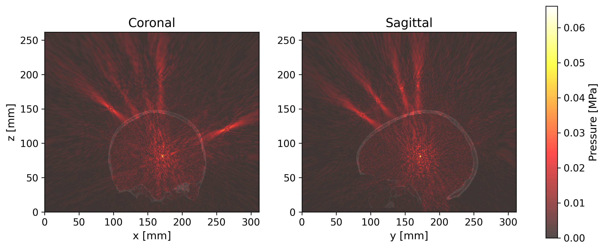
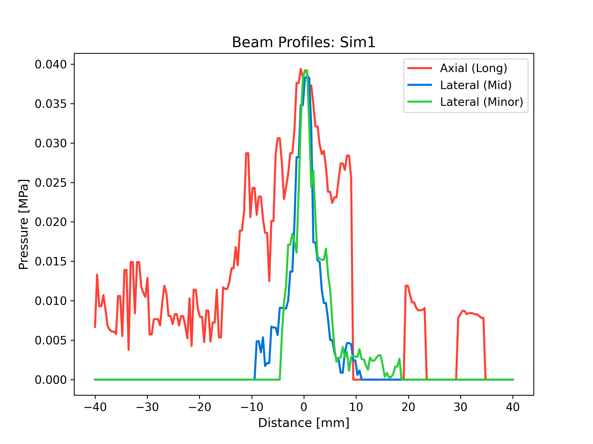
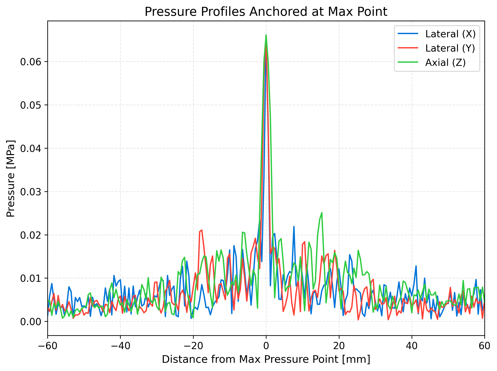
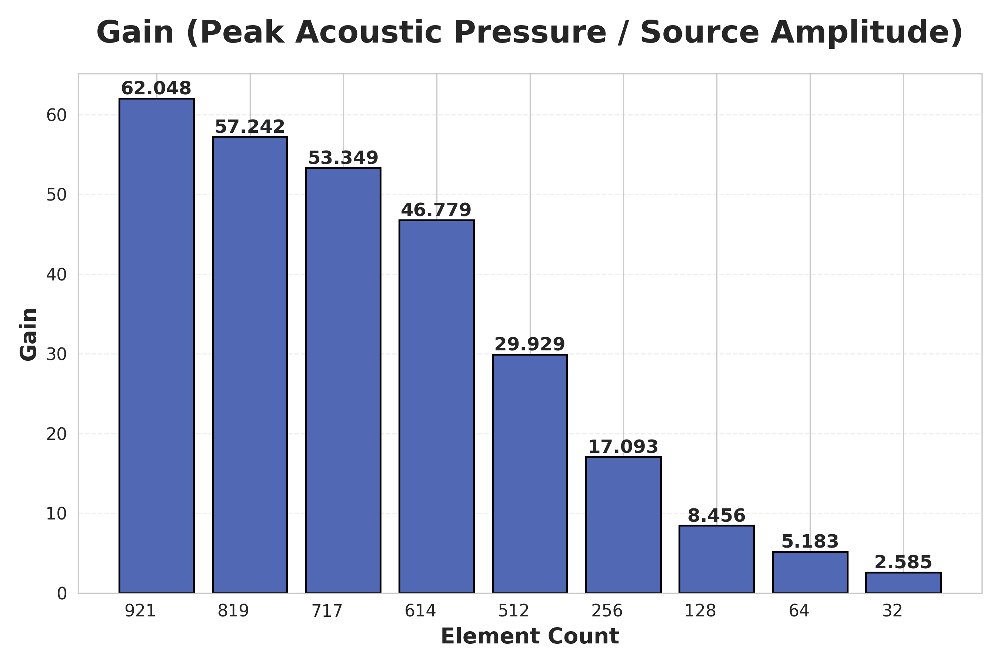
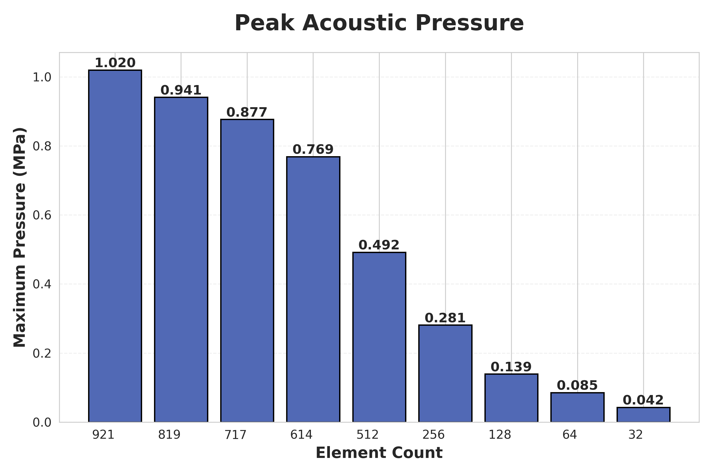
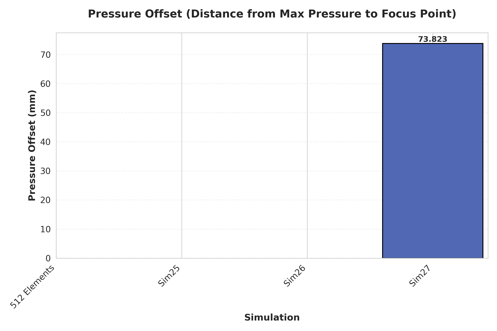
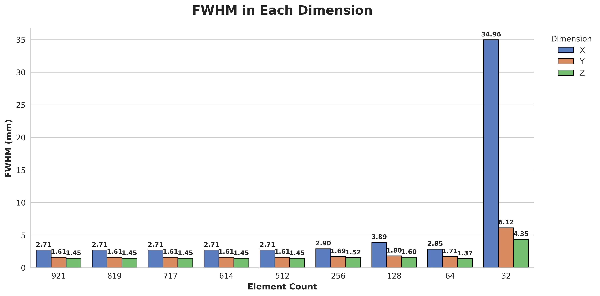

# Focused Ultrasound Simulation Analysis

## Project Overview
An automated Pipeline to analyze 3D acoustic pressure fields and validate focussed ultrasound targetting, with the intent of investigating neuromodulation of specific brain structures.
- LIFU_Simulation_Analysis: Analyzes pressure fields from transcranial focused ultrasound (FUS) simulation results to perform beam profiling, focal volume estimation, and anatomical visualization, which are logged and outputted as figures.
- Cross-simlation Comparative Analysis: Aggregates results across multiple subject IDs and targets, facilitating parametric comparisons. 

## Motivation
Accurate targeting in transcranial FUS is challenging due to skull-induced distortion.
This project builds tools to quantify beam focusing quality and analyze simulation outputs. 

## System Requiremements
- Python Environment: REquires Python 3.x with numpy, scipy, matplotlib, pandas, h5py, and PyYAML
- Data Sources: Designed to process .h5 files (pressure and anatomy) and .yml configuration fiels exported from simulation runs.

## Usage and Workflow

1. Individual Simulation Analysis
- Input Directory: This script scans PRESSURE_ROOT (defaulting to ~/Documents/simulation_analysis/pressure_results) for new SimXXX folders.
- Excecution: Triggers the batch processing of any folder that does not yet contain an analysis.csv file
- Output Artifacts:
  - analysis.csv: A summary of metrics including mxP, FWHM volume, and focal displacement
  - Principal Axes Plot: Beam profiles along the major and minor aces of the focal one.
  - Anatomy Overlay: Coronal and sagittal slices showing the pressue field reigstered to the underlying anatomy. 

2. Cross-Simulation Comparison
- Input Directory: This script scans PRESSURE_ROOT (defaulting to ~/Documents/simulation_analysis/pressure_results) for SimXXX folders containing analysis.csv files
- Excecution: Compiles resuls from the analysis.csv files to produce comparative plots, returns to (defaulting to ~/Documents/simulation_analysis/summary_plots)
- Output Artifacts:
  - Peak Acoustic Pressure Bar Plot
  - Gain Bar Plot: Assembly of (Peak Acoustic Pressure / Source Amplitude) Values 
  - FWHM in each dimension Clustered Bar Plot

## Example Output

Individual Simulation Analysis: 





Cross-Simulation Comparison





## How to Run
```bash
pip install -r requirements.txt
python scripts/run_analysis.py
